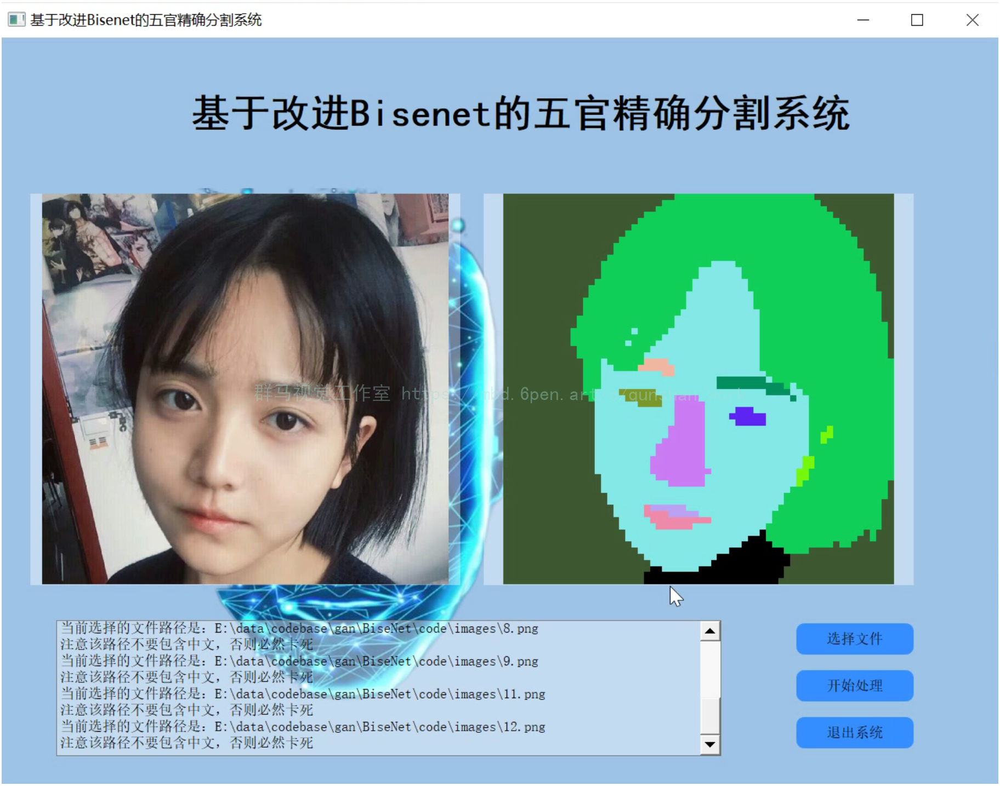
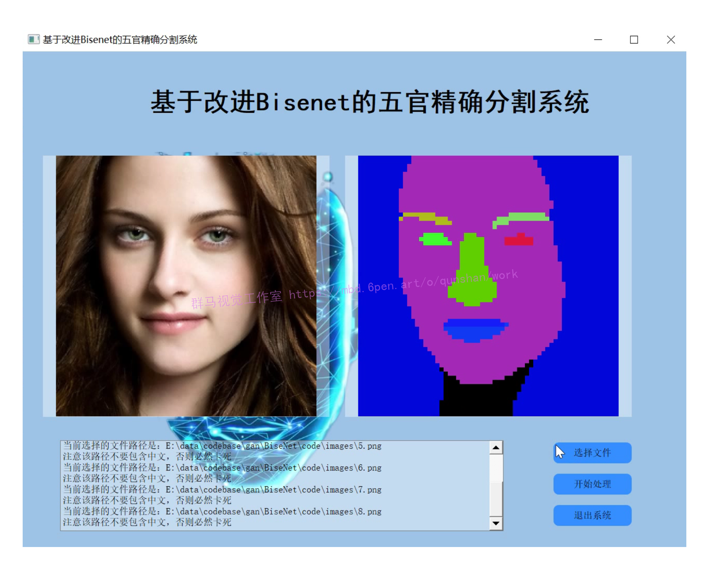
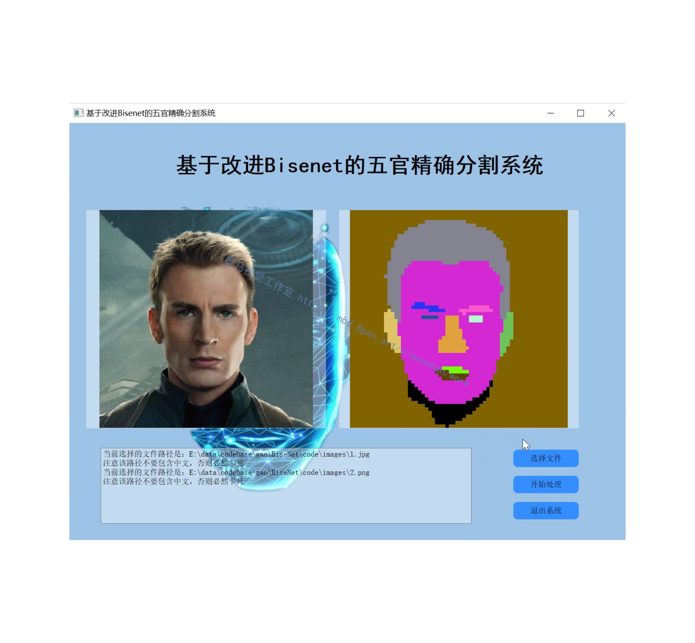
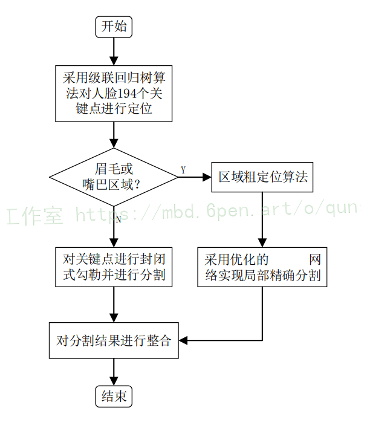
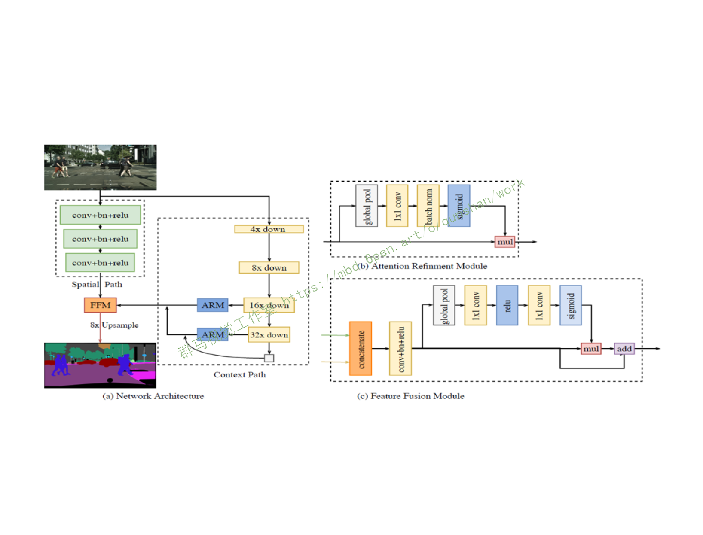
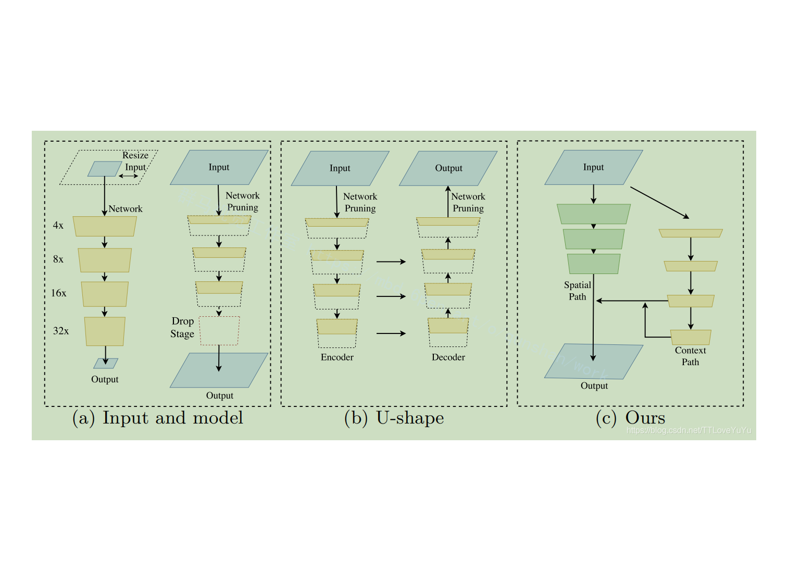
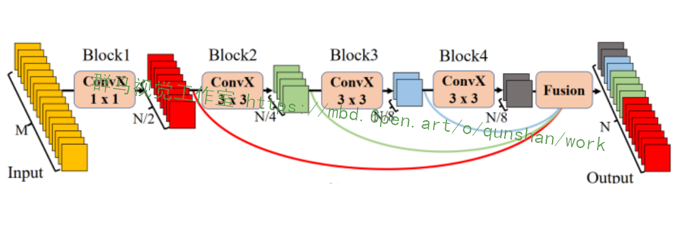
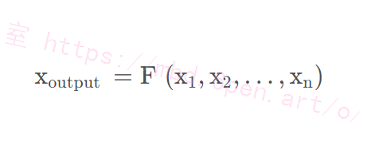

# 1.研究背景

随着机器学习理论的不断成熟和深度学习技术的迅猛发展，人脸五官图像分割任务近年来得到了相关研究人员的普遍关注。五官图像分割技术可以实现对人脸的细粒度解析，在人脸表情识别、人脸编辑和美容模拟等诸多领域有广泛的应用空间。然而在实际应用时，人脸五官图像分割技术尚存有不足之处。比如，目前主流的人脸五官分割技术采用的是深度学习多网络融合模型，虽然可以获得高精确度的分割效果，但其庞大的网络结构往往需要昂贵的设备支持和较大的时间代价，限制了方法的实际应用。此外，在后续的人脸五官图像拼接应用中，图像之间的清晰度不一致问题，也会严重影响模拟效果。

# 2.图片演示






# 3.视频演示
[基于改进Bisenet的五官图像精确分割系统（源码＆教程）_哔哩哔哩_bilibili](https://www.bilibili.com/video/BV1Y24y1Q7eQ/?vd_source=bc9aec86d164b67a7004b996143742dc)

# 4.算法流程图


# 5.Bisenet简介

丰富的空间信息和足够大的感知域是语义分割任务所必须的两个点。然而现在的方法并不能得到很好的效果。在本篇论文中，使用新颖的双向分割网络（Bilateral segmentation Network）就能解决这个困境。首先，设计一个小步长的空间路径来保留空间信息并且产生高分辨率的特征，设计一个快速下采样的上下文路径获取足够大的接受域。在这两个路径的顶部，我们设计了一个新的特征融合模块来更好的结合有效的特征。这个结构有效的平衡处理速度和模型的分割效率之间的关系。特别说明：对于2048和1024的输入，使用Titan XP的NVIDIA处理器，在Cityscapes数据集上实现了68.4%的 Mean IOU，105FPS，在表现不下降的前提下，比现有的模型都快！
BiSeNet的两部分：Spatial Path、Context Path。
两个部分分别针对空间信息和感受野而设计。对于Spatial Path而言，我们只堆叠了三个卷积层来获取原图像1/8 大小的特征图，在这个特种图例包含了充足的空间细节。而对于Context Path，我们在Xception分离卷积的基础上增加了一个平均池化层，这样就能得到更大的感受野，在图一（c）中有详细的结构！

在保持效率的前提下最求更好的结果，[该博客提出了两种Path的融合以及最终预测结果的改进并分别提出了Feture Fusion Module和Attention Refinement Module模块](https://mbd.pub/o/bread/Y52VlZls)。这两个模块对于提高模型的分割准确度可以起到很好的作用！


# 6.网络改进
为了减少算法的耗时，一些诸如DFANet、BiSeNet的语义分割算法使用了轻量化backbone，但是它们都是直接使用为分类任务设计的backbone，群马视觉工作室认为，专为分类任务设计的backbone不能在语义分割领域中充分发挥它们的性能。

BiSeNet使用了multi-path结构的网络融合低层次特征和高层次特征，然而额外增加分支会增加网络的运行时间。

[参考该博客提出了STDC模块](https://afdian.net/item?plan_id=edebb19a779111edb9d952540025c377)，能够使用较少的参数量提取多尺度特征，且能够很方便地集成到BiSeNet类型的语义分割网络中；对BiSeNet中的multi-path结构做出改进，在提取底层细节特征的同时减少网络计算量。
#### STDC（Short-Term Dense Concatenate）模块

STDC模块的结构如下图所示：

图中的C o n v X ConvXConvX表示“卷积+BN+ReLU”操作，M MM表示输入特征通道数，N NN表示输出特征通道数。

在STDC模块中，第1个block的卷积核尺寸为1 × 1 1 \times 11×1，其余block的卷积核尺寸为3 × 3 3 \times 33×3。

若STDC模块的最终输出通道数为N NN，除最后一个block外，该模块内第i ii个block的输出通道数为N / 2 i N / 2^{i}N/2 i；
最后一个block的输出特征通道数与倒数第二个block保持一致。

与传统的backbone不同的是，STDC模块中深层的特征通道数少，浅层的特征通道数多。作者认为，浅层需要更多通道的特征编码细节信息；深层更关注高层次语义信息，过多的特征通道数量会导致信息冗余。

STDC模块最终的输出为各block输出特征的融合，即：


#### 7.代码实现
```
import torch
import torch.nn as nn
from torch.nn import init
import math


class ConvX(nn.Module):
    def __init__(self, in_planes, out_planes, kernel=3, stride=1):
        super(ConvX, self).__init__()
        self.conv = nn.Conv2d(in_planes, out_planes, kernel_size=kernel, stride=stride, padding=kernel//2, bias=False)
        self.bn = nn.BatchNorm2d(out_planes)
        self.relu = nn.ReLU(inplace=True)

    def forward(self, x):
        out = self.relu(self.bn(self.conv(x)))
        return out


class AddBottleneck(nn.Module):
    def __init__(self, in_planes, out_planes, block_num=3, stride=1):
        super(AddBottleneck, self).__init__()
        assert block_num > 1, print("block number should be larger than 1.")
        self.conv_list = nn.ModuleList()
        self.stride = stride
        if stride == 2:
            self.avd_layer = nn.Sequential(
                nn.Conv2d(out_planes//2, out_planes//2, kernel_size=3, stride=2, padding=1, groups=out_planes//2, bias=False),
                nn.BatchNorm2d(out_planes//2),
            )
            self.skip = nn.Sequential(
                nn.Conv2d(in_planes, in_planes, kernel_size=3, stride=2, padding=1, groups=in_planes, bias=False),
                nn.BatchNorm2d(in_planes),
                nn.Conv2d(in_planes, out_planes, kernel_size=1, bias=False),
                nn.BatchNorm2d(out_planes),
            )
            stride = 1

        for idx in range(block_num):
            if idx == 0:
                self.conv_list.append(ConvX(in_planes, out_planes//2, kernel=1))
            elif idx == 1 and block_num == 2:
                self.conv_list.append(ConvX(out_planes//2, out_planes//2, stride=stride))
            elif idx == 1 and block_num > 2:
                self.conv_list.append(ConvX(out_planes//2, out_planes//4, stride=stride))
            elif idx < block_num - 1:
                self.conv_list.append(ConvX(out_planes//int(math.pow(2, idx)), out_planes//int(math.pow(2, idx+1))))
            else:
                self.conv_list.append(ConvX(out_planes//int(math.pow(2, idx)), out_planes//int(math.pow(2, idx))))
            
    def forward(self, x):
        out_list = []
        out = x

        for idx, conv in enumerate(self.conv_list):
            if idx == 0 and self.stride == 2:
                out = self.avd_layer(conv(out))
            else:
                out = conv(out)
            out_list.append(out)

        if self.stride == 2:
            x = self.skip(x)

        return torch.cat(out_list, dim=1) + x


class CatBottleneck(nn.Module):
    def __init__(self, in_planes, out_planes, block_num=3, stride=1):
        super(CatBottleneck, self).__init__()
        assert block_num > 1, print("block number should be larger than 1.")
        self.conv_list = nn.ModuleList()
        self.stride = stride
        if stride == 2:
            self.avd_layer = nn.Sequential(
                nn.Conv2d(out_planes//2, out_planes//2, kernel_size=3, stride=2, padding=1, groups=out_planes//2, bias=False),
                nn.BatchNorm2d(out_planes//2),
            )
            self.skip = nn.AvgPool2d(kernel_size=3, stride=2, padding=1)
            stride = 1

        for idx in range(block_num):
            if idx == 0:
                self.conv_list.append(ConvX(in_planes, out_planes//2, kernel=1))
            elif idx == 1 and block_num == 2:
                self.conv_list.append(ConvX(out_planes//2, out_planes//2, stride=stride))
            elif idx == 1 and block_num > 2:
                self.conv_list.append(ConvX(out_planes//2, out_planes//4, stride=stride))
            elif idx < block_num - 1:
                self.conv_list.append(ConvX(out_planes//int(math.pow(2, idx)), out_planes//int(math.pow(2, idx+1))))
            else:
                self.conv_list.append(ConvX(out_planes//int(math.pow(2, idx)), out_planes//int(math.pow(2, idx))))
            
    def forward(self, x):
        out_list = []
        out1 = self.conv_list[0](x)

        for idx, conv in enumerate(self.conv_list[1:]):
            if idx == 0:
                if self.stride == 2:
                    out = conv(self.avd_layer(out1))
                else:
                    out = conv(out1)
            else:
                out = conv(out)
            out_list.append(out)

        if self.stride == 2:
            out1 = self.skip(out1)
        out_list.insert(0, out1)

        out = torch.cat(out_list, dim=1)
        return out

#STDC2Net
class STDCNet1446(nn.Module):
    def __init__(self, base=64, layers=[4,5,3], block_num=4, type="cat", num_classes=1000, dropout=0.20, pretrain_model='', use_conv_last=False):
        super(STDCNet1446, self).__init__()
        if type == "cat":
            block = CatBottleneck
        elif type == "add":
            block = AddBottleneck
        self.use_conv_last = use_conv_last
        self.features = self._make_layers(base, layers, block_num, block)
        self.conv_last = ConvX(base*16, max(1024, base*16), 1, 1)
        self.gap = nn.AdaptiveAvgPool2d(1)
        self.fc = nn.Linear(max(1024, base*16), max(1024, base*16), bias=False)
        self.bn = nn.BatchNorm1d(max(1024, base*16))
        self.relu = nn.ReLU(inplace=True)
        self.dropout = nn.Dropout(p=dropout)
        self.linear = nn.Linear(max(1024, base*16), num_classes, bias=False)

        self.x2 = nn.Sequential(self.features[:1])
        self.x4 = nn.Sequential(self.features[1:2])
        self.x8 = nn.Sequential(self.features[2:6])
        self.x16 = nn.Sequential(self.features[6:11])
        self.x32 = nn.Sequential(self.features[11:])

        if pretrain_model:
            print('use pretrain model {}'.format(pretrain_model))
            self.init_weight(pretrain_model)
        else:
            self.init_params()

    def init_weight(self, pretrain_model):
        
        state_dict = torch.load(pretrain_model)["state_dict"]
        self_state_dict = self.state_dict()
        for k, v in state_dict.items():
            self_state_dict.update({k: v})
        self.load_state_dict(self_state_dict)

    def init_params(self):
        for m in self.modules():
            if isinstance(m, nn.Conv2d):
                init.kaiming_normal_(m.weight, mode='fan_out')
                if m.bias is not None:
                    init.constant_(m.bias, 0)
            elif isinstance(m, nn.BatchNorm2d):
                init.constant_(m.weight, 1)
                init.constant_(m.bias, 0)
            elif isinstance(m, nn.Linear):
                init.normal_(m.weight, std=0.001)
                if m.bias is not None:
                    init.constant_(m.bias, 0)

    def _make_layers(self, base, layers, block_num, block):
        features = []
        features += [ConvX(3, base//2, 3, 2)]
        features += [ConvX(base//2, base, 3, 2)]

        for i, layer in enumerate(layers):
            for j in range(layer):
                if i == 0 and j == 0:
                    features.append(block(base, base*4, block_num, 2))
                elif j == 0:
                    features.append(block(base*int(math.pow(2,i+1)), base*int(math.pow(2,i+2)), block_num, 2))
                else:
                    features.append(block(base*int(math.pow(2,i+2)), base*int(math.pow(2,i+2)), block_num, 1))

        return nn.Sequential(*features)

    def forward(self, x):
        feat2 = self.x2(x)
        feat4 = self.x4(feat2)
        feat8 = self.x8(feat4)
        feat16 = self.x16(feat8)
        feat32 = self.x32(feat16)
        if self.use_conv_last:
           feat32 = self.conv_last(feat32)

        return feat2, feat4, feat8, feat16, feat32

    def forward_impl(self, x):
        out = self.features(x)
        out = self.conv_last(out).pow(2)
        out = self.gap(out).flatten(1)
        out = self.fc(out)
        # out = self.bn(out)
        out = self.relu(out)
        # out = self.relu(self.bn(self.fc(out)))
        out = self.dropout(out)
        out = self.linear(out)
        return out

# STDC1Net
class STDCNet813(nn.Module):
    def __init__(self, base=64, layers=[2,2,2], block_num=4, type="cat", num_classes=1000, dropout=0.20, pretrain_model='', use_conv_last=False):
        super(STDCNet813, self).__init__()
        if type == "cat":
            block = CatBottleneck
        elif type == "add":
            block = AddBottleneck
        self.use_conv_last = use_conv_last
        self.features = self._make_layers(base, layers, block_num, block)
        self.conv_last = ConvX(base*16, max(1024, base*16), 1, 1)
        self.gap = nn.AdaptiveAvgPool2d(1)
        self.fc = nn.Linear(max(1024, base*16), max(1024, base*16), bias=False)
        self.bn = nn.BatchNorm1d(max(1024, base*16))
        self.relu = nn.ReLU(inplace=True)
        self.dropout = nn.Dropout(p=dropout)
        self.linear = nn.Linear(max(1024, base*16), num_classes, bias=False)

        self.x2 = nn.Sequential(self.features[:1])
        self.x4 = nn.Sequential(self.features[1:2])
        self.x8 = nn.Sequential(self.features[2:4])
        self.x16 = nn.Sequential(self.features[4:6])
        self.x32 = nn.Sequential(self.features[6:])

        if pretrain_model:
            print('use pretrain model {}'.format(pretrain_model))
            self.init_weight(pretrain_model)
        else:
            self.init_params()

    def init_weight(self, pretrain_model):
        
        state_dict = torch.load(pretrain_model)["state_dict"]
        self_state_dict = self.state_dict()
        for k, v in state_dict.items():
            self_state_dict.update({k: v})
        self.load_state_dict(self_state_dict)

    def init_params(self):
        for m in self.modules():
            if isinstance(m, nn.Conv2d):
                init.kaiming_normal_(m.weight, mode='fan_out')
                if m.bias is not None:
                    init.constant_(m.bias, 0)
            elif isinstance(m, nn.BatchNorm2d):
                init.constant_(m.weight, 1)
                init.constant_(m.bias, 0)
            elif isinstance(m, nn.Linear):
                init.normal_(m.weight, std=0.001)
                if m.bias is not None:
                    init.constant_(m.bias, 0)

    def _make_layers(self, base, layers, block_num, block):
        features = []
        features += [ConvX(3, base//2, 3, 2)]
        features += [ConvX(base//2, base, 3, 2)]

        for i, layer in enumerate(layers):
            for j in range(layer):
                if i == 0 and j == 0:
                    features.append(block(base, base*4, block_num, 2))
                elif j == 0:
                    features.append(block(base*int(math.pow(2,i+1)), base*int(math.pow(2,i+2)), block_num, 2))
                else:
                    features.append(block(base*int(math.pow(2,i+2)), base*int(math.pow(2,i+2)), block_num, 1))

        return nn.Sequential(*features)

    def forward(self, x):
        feat2 = self.x2(x)
        feat4 = self.x4(feat2)
        feat8 = self.x8(feat4)
        feat16 = self.x16(feat8)
        feat32 = self.x32(feat16)
        if self.use_conv_last:
           feat32 = self.conv_last(feat32)

        return feat2, feat4, feat8, feat16, feat32

    def forward_impl(self, x):
        out = self.features(x)
        out = self.conv_last(out).pow(2)
        out = self.gap(out).flatten(1)
        out = self.fc(out)
        # out = self.bn(out)
        out = self.relu(out)
        # out = self.relu(self.bn(self.fc(out)))
        out = self.dropout(out)
        out = self.linear(out)
        return out

if __name__ == "__main__":
    model = STDCNet813(num_classes=1000, dropout=0.00, block_num=4)
    model.eval()
    x = torch.randn(1,3,224,224)
    y = model(x)
    torch.save(model.state_dict(), 'cat.pth')
    print(y.size())
```
# 8.系统整合
下图[完整源码＆环境部署视频教程＆自定义UI界面](https://s.xiaocichang.com/s/38a20c)：


参考博客[《基于改进Bisenet的五官精确分割系统（源码＆教程）》](https://mbd.pub/o/qunma/work)

# 9.参考文献
***
[1][李月龙](https://s.wanfangdata.com.cn/paper?q=%E4%BD%9C%E8%80%85:%22%E6%9D%8E%E6%9C%88%E9%BE%99%22),[靳彦](https://s.wanfangdata.com.cn/paper?q=%E4%BD%9C%E8%80%85:%22%E9%9D%B3%E5%BD%A6%22),[汪剑鸣](https://s.wanfangdata.com.cn/paper?q=%E4%BD%9C%E8%80%85:%22%E6%B1%AA%E5%89%91%E9%B8%A3%22),等.[人脸特征点提取方法综述](https://d.wanfangdata.com.cn/periodical/jsjxb201607006)[J].[计算机学报](https://sns.wanfangdata.com.cn/perio/jsjxb).2016,(7).DOI:[10.11897/SP.J.1016.2016.01356](http://dx.chinadoi.cn/10.11897/SP.J.1016.2016.01356).

[2][谭伟](https://s.wanfangdata.com.cn/paper?q=%E4%BD%9C%E8%80%85:%22%E8%B0%AD%E4%BC%9F%22),[杨秉新](https://s.wanfangdata.com.cn/paper?q=%E4%BD%9C%E8%80%85:%22%E6%9D%A8%E7%A7%89%E6%96%B0%22),[何红艳](https://s.wanfangdata.com.cn/paper?q=%E4%BD%9C%E8%80%85:%22%E4%BD%95%E7%BA%A2%E8%89%B3%22).[一种新的遥感影像清晰度评价方法](https://d.wanfangdata.com.cn/periodical/zgkjkxjs201602007)[J].[中国空间科学技术](https://sns.wanfangdata.com.cn/perio/zgkjkxjs).2016,(2).DOI:[10.16708/j.cnki.1000-758X.2016.0024](http://dx.chinadoi.cn/10.16708/j.cnki.1000-758X.2016.0024).

[3][王志明](https://s.wanfangdata.com.cn/paper?q=%E4%BD%9C%E8%80%85:%22%E7%8E%8B%E5%BF%97%E6%98%8E%22).[无参考图像质量评价综述](https://d.wanfangdata.com.cn/periodical/zdhxb201506002)[J].[自动化学报](https://sns.wanfangdata.com.cn/perio/zdhxb).2015,(6).DOI:[10.16383/j.aas.2015.c140404](http://dx.chinadoi.cn/10.16383/j.aas.2015.c140404).

[4][谢小甫](https://s.wanfangdata.com.cn/paper?q=%E4%BD%9C%E8%80%85:%22%E8%B0%A2%E5%B0%8F%E7%94%AB%22),[周进](https://s.wanfangdata.com.cn/paper?q=%E4%BD%9C%E8%80%85:%22%E5%91%A8%E8%BF%9B%22),[吴钦章](https://s.wanfangdata.com.cn/paper?q=%E4%BD%9C%E8%80%85:%22%E5%90%B4%E9%92%A6%E7%AB%A0%22).[一种针对图像模糊的无参考质量评价指标](https://d.wanfangdata.com.cn/periodical/jsjyy201004018)[J].[计算机应用](https://sns.wanfangdata.com.cn/perio/jsjyy).2010,(4).

[5][沈国鑫](https://s.wanfangdata.com.cn/paper?q=%E4%BD%9C%E8%80%85:%22%E6%B2%88%E5%9B%BD%E9%91%AB%22),[陈国金](https://s.wanfangdata.com.cn/paper?q=%E4%BD%9C%E8%80%85:%22%E9%99%88%E5%9B%BD%E9%87%91%22),[费海波](https://s.wanfangdata.com.cn/paper?q=%E4%BD%9C%E8%80%85:%22%E8%B4%B9%E6%B5%B7%E6%B3%A2%22).[基于小波变换和神经网络的数字图像清晰度识别算法](https://d.wanfangdata.com.cn/periodical/jdgc200804008)[J].[机电工程](https://sns.wanfangdata.com.cn/perio/jdgc).2008,(4).DOI:[10.3969/j.issn.1001-4551.2008.04.008](http://dx.chinadoi.cn/10.3969/j.issn.1001-4551.2008.04.008).

[6][蔡超](https://s.wanfangdata.com.cn/paper?q=%E4%BD%9C%E8%80%85:%22%E8%94%A1%E8%B6%85%22),[丁明跃](https://s.wanfangdata.com.cn/paper?q=%E4%BD%9C%E8%80%85:%22%E4%B8%81%E6%98%8E%E8%B7%83%22),[周成平](https://s.wanfangdata.com.cn/paper?q=%E4%BD%9C%E8%80%85:%22%E5%91%A8%E6%88%90%E5%B9%B3%22),等.[小波域中的双边滤波](https://d.wanfangdata.com.cn/periodical/dianzixb200401030)[J].[电子学报](https://sns.wanfangdata.com.cn/perio/dianzixb).2004,(1).DOI:[10.3321/j.issn:0372-2112.2004.01.030](http://dx.chinadoi.cn/10.3321/j.issn:0372-2112.2004.01.030).

[7][周杰](https://s.wanfangdata.com.cn/paper?q=%E4%BD%9C%E8%80%85:%22%E5%91%A8%E6%9D%B0%22),[卢春雨](https://s.wanfangdata.com.cn/paper?q=%E4%BD%9C%E8%80%85:%22%E5%8D%A2%E6%98%A5%E9%9B%A8%22),[张长水](https://s.wanfangdata.com.cn/paper?q=%E4%BD%9C%E8%80%85:%22%E5%BC%A0%E9%95%BF%E6%B0%B4%22),等.[人脸自动识别方法综述](https://d.wanfangdata.com.cn/periodical/dianzixb200004027)[J].[电子学报](https://sns.wanfangdata.com.cn/perio/dianzixb).2000,(4).DOI:[10.3321/j.issn:0372-2112.2000.04.027](http://dx.chinadoi.cn/10.3321/j.issn:0372-2112.2000.04.027).

[8][张小利](https://s.wanfangdata.com.cn/paper?q=%E4%BD%9C%E8%80%85:%22%E5%BC%A0%E5%B0%8F%E5%88%A9%22),[李雄飞](https://s.wanfangdata.com.cn/paper?q=%E4%BD%9C%E8%80%85:%22%E6%9D%8E%E9%9B%84%E9%A3%9E%22),[李军](https://s.wanfangdata.com.cn/paper?q=%E4%BD%9C%E8%80%85:%22%E6%9D%8E%E5%86%9B%22).融合图像质量评价指标的相关性分析及性能评估[J].[自动化学报](https://sns.wanfangdata.com.cn/perio/zdhxb).2014,(2).DOI:[10.3724/SP.J.1004.2014.00306](http://dx.chinadoi.cn/10.3724/SP.J.1004.2014.00306).

[9][赵志彬](https://s.wanfangdata.com.cn/paper?q=%E4%BD%9C%E8%80%85:%22%E8%B5%B5%E5%BF%97%E5%BD%AC%22),[刘晶红](https://s.wanfangdata.com.cn/paper?q=%E4%BD%9C%E8%80%85:%22%E5%88%98%E6%99%B6%E7%BA%A2%22).[基于图像功率谱的航空光电平台自动检焦设计](https://d.wanfangdata.com.cn/periodical/gxxb201012023)[J].[光学学报](https://sns.wanfangdata.com.cn/perio/gxxb).2010,(12).DOI:[10.3788/AOS20103012.3495](http://dx.doi.org/10.3788/AOS20103012.3495).

[10][李慧芳](https://s.wanfangdata.com.cn/paper?q=%E4%BD%9C%E8%80%85:%22%E6%9D%8E%E6%85%A7%E8%8A%B3%22).基于卷积特征的人脸特征点定位研究[D].2017.


---
#### 如果您需要更详细的【源码和环境部署教程】，除了通过【系统整合】小节的链接获取之外，还可以通过邮箱以下途径获取:
#### 1.请先在GitHub上为该项目点赞（Star），编辑一封邮件，附上点赞的截图、项目的中文描述概述（About）以及您的用途需求，发送到我们的邮箱
#### sharecode@yeah.net
#### 2.我们收到邮件后会定期根据邮件的接收顺序将【完整源码和环境部署教程】发送到您的邮箱。
#### 【免责声明】本文来源于用户投稿，如果侵犯任何第三方的合法权益，可通过邮箱联系删除。